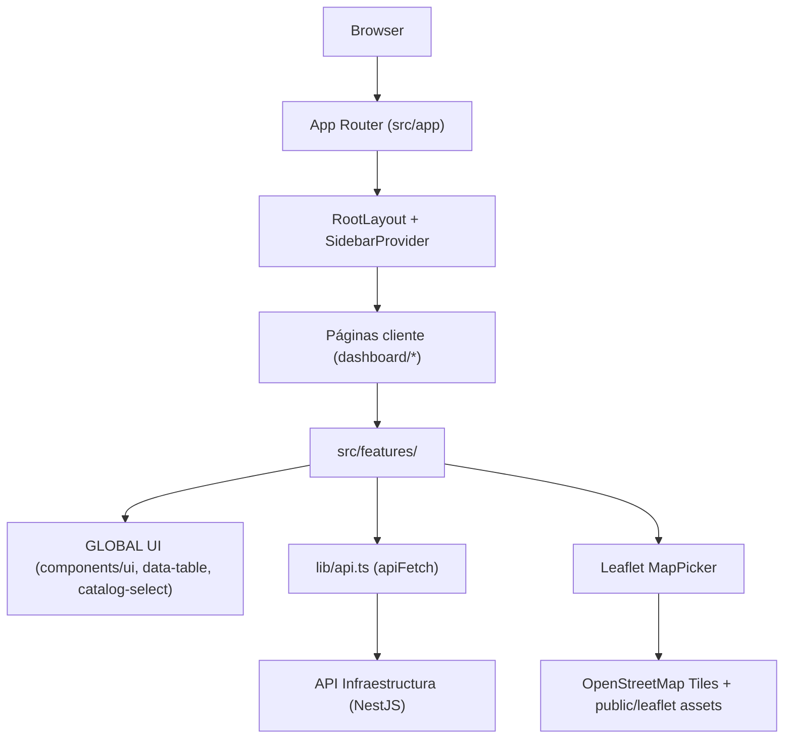

# Arquitectura Técnica

## 1. Contexto y objetivos
- **Dominio**: Inventario físico de la universidad (campus, facultades, bloques, ambientes, tipos y activos). Todo el front consume el backend NestJS descrito en `Project_Specs.md` mediante REST JSON bajo `NEXT_PUBLIC_API_BASE_URL`.
- **Objetivo del front**: Proveer vistas CRUD rápidas, accesibles y autoexplicativas para cada entidad, apoyándose en formularios guiados, tablas configurables y mapas Leaflet para coordenadas.
- **Principios**: Hexagonal / Ports & Adapters: el UI (Adapters) solo habla con el puerto `lib/api.ts`. La regla de dependencias apunta hacia el dominio (`src/features/<domain>`). Se aplica Scope Rule Global/Local para ubicar piezas reutilizables.

## 2. Stack y lineamientos clave
### Frontend core
- Next.js 15 (App Router) + React 19 + TypeScript estricto (`tsconfig.json` habilita `strict`, `jsx: preserve` y el alias `@/*`). `src/app/layout.tsx` orquesta providers, fuentes Geist y estilos globales.
- Tailwind CSS 4 + shadcn/ui (Radix) viven en `src/components/ui`. El patrón Container/Presentational se respeta combinando UI genérica (GLOBAL) con vistas de dominio (LOCAL).
- App Router usa layouts por ruta (`src/app/dashboard/**/layout.tsx` cuando aplica) y páginas cliente (`"use client"`) para habilitar React state, maps y formularios.

### Estado, formularios y visualizaciones
- React Hook Form + Zod (por feature en `src/features/**/schema.ts`) garantizan validaciones antes del submit. Los schemas exportan los tipos de entrada/salida a reusar en forms, dialogs y tablas.
- TanStack Table + `src/components/data-table*.tsx` proveen tablas paginadas configurables con ordenamiento, toggles de columnas y paginación accesible.
- Leaflet + react-leaflet (`features/campus/MapPicker.tsx`, reusado en bloques/ambientes) permite elegir coordenadas con tiles OSM y assets en `public/leaflet/*`.
- Sonner + `src/lib/notify.tsx` centralizan toasts con variaciones consistentes.

### Tooling y calidad
- `pnpm` scripts (`package.json`): `pnpm dev` expone `http://localhost:3001`, `pnpm build`, `pnpm lint`, `pnpm test` (Vitest) y `pnpm test:e2e` (Playwright). `pnpm test:e2eReal` ejecuta contra backend real.
- ESLint (`eslint.config.mjs`) y Prettier (via ESLint) deben correr antes de cada commit. Security by Design implica validar inputs con Zod y sanear payloads antes de renderizarlos.
- Vitest (`vitest.config.ts`) usa `jsdom`, `test/setup.ts` y cobertura V8. Playwright (`playwright.config.ts`) levanta el server de Next de forma automática y permite mocks condicionados con `E2E_USE_API`.

## 3. Organización y Scope Rule
GLOBAL = usado en 2+ features. LOCAL = exclusivo de una feature.

| Scope | Ruta | Responsabilidad |
| --- | --- | --- |
| GLOBAL | `src/app/layout.tsx`, `src/app/globals.css` | Shell, fuentes, providers y estilos compartidos. |
| GLOBAL | `src/components/` | UI reutilizable: sidebar, data-table, selects, dialogs, inputs. |
| GLOBAL | `src/config/` | Menú (`nav.ts`) y catálogos estáticos (`classifiers.ts`). |
| GLOBAL | `src/lib/` | Puertos (`api.ts`, `env.ts`), utilidades (`utils.ts`), notificaciones (`notify.tsx`). |
| GLOBAL | `src/hooks/` | Hooks transversales (ej. `useIsMobile`). |
| GLOBAL | `public/` | Activos compartidos (logo UMSS, assets Leaflet). |
| LOCAL | `src/features/<dominio>/` | Formularios, schemas, columnas de tablas y helpers específicos del dominio. |
| LOCAL | `src/app/dashboard/<dominio>/<vista>` | Páginas App Router que montan componentes del feature, manejan routing y dialogs. |
| LOCAL | `tests/e2e/**` | Casos end-to-end por feature (mock vs real). |

Reglas:
- Las páginas bajo `src/app/dashboard/**` **solo** importan componentes GLOBAL + su feature LOCAL.
- `src/features/**` puede depender de `src/components`, `src/lib`, `src/config`, pero nunca al revés.
- Reutilizar assets/local state entre dominios ⇒ promoverlos a GLOBAL (u otro subdirectorio compartido) para cumplir Scope Rule.

## 4. Organización de carpetas
```
.
├─ public/                  # Activos estáticos globales (logo, tiles Leaflet)
├─ src/
│  ├─ app/                  # App Router (layouts, páginas dashboard/*, api routes si aplica)
│  │  ├─ layout.tsx         # RootLayout (fuentes, SidebarProvider, Toaster)
│  │  ├─ globals.css        # Estilos globales
│  │  └─ dashboard/         # Rutas de negocio (campus, bloques, ambientes…)
│  ├─ components/
│  │  ├─ ui/                # Biblioteca shadcn/ui adaptada (botones, inputs, dialog, sidebar…)
│  │  ├─ data-table*.tsx    # Infraestructura de tablas TanStack reutilizable
│  │  └─ catalog-search-select.tsx # Select con búsqueda global
│  ├─ config/               # Configuración estática (nav, clasificadores)
│  ├─ features/
│  │  ├─ campus/            # Formularios, schemas y columnas propios del dominio
│  │  ├─ blocks/
│  │  ├─ environments/
│  │  └─ …                  # Cada subcarpeta encierra edit/list/create y helpers locales
│  ├─ hooks/                # Hooks compartidos (p. ej. useIsMobile)
│  └─ lib/                  # Utilidades globales (apiFetch, env, notify, utils)
├─ tests/
│  └─ e2e/                  # Escenarios Playwright (mock / real) + utils de interceptación
├─ test/                    # Setup y helpers para Vitest
├─ playwright*.ts           # Config de E2E (local vs real)
├─ vitest.config.ts         # Configuración de pruebas unitarias
└─ Project_Specs.md         # Especificación funcional del dominio
```
Al agregar nuevas piezas, ubícalas en el nivel adecuado: UI transversal en `components/`, lógica de dominio en `features/<dominio>`, rutas en `src/app/dashboard/<dominio>`, y configuraciones/constantes en `config/`. Mantener la consistencia del árbol facilita detectar dependencias incorrectas y permite que el “repo grite el dominio”.

## 5. Capas y flujo de datos
1. **App Router** (`src/app`) define layouts, rutas y metadata. `RootLayout` añade `SidebarProvider`/`AppSidebar`, `SidebarTrigger`, cabecera y `Toaster` de Sonner.
2. **Páginas cliente** (`"use client"`) manejan estado, efectos y componen features (p. ej. `src/app/dashboard/campus/list/page.tsx`). La UI se divide en filtros + DataTable + modales (create/edit/delete).\
3. **Features** empaquetan formularios, listados y lógica del dominio. Ejemplos: `CampusForm`, `BlockCreateForm`, `EnvironmentEditDialog`.
4. **Ports & adapters**: `lib/api.ts` normaliza fetch (`apiFetch`) agregando headers JSON, parse automático y errores con `{ status, message, details }`. Mutaciones usan este puerto; algunos listados usan `fetch` directo para aprovechar `AbortController`.
5. **Backend NestJS** expuesto vía `NEXT_PUBLIC_API_BASE_URL` maneja la lógica central (ver `Project_Specs.md`). La UI consume endpoints `/campus`, `/facultades`, `/bloques`, `/ambientes`, etc.
6. **Feedback**: `lib/notify` dispara toasts; `Dialog` confirma acciones y los `Badge`/`Input` de shadcn muestran estados accesibles.



## 6. Componentes GLOBAL destacados
- **Layout & navegación** (`src/components/ui/sidebar.tsx`, `src/components/app-sidebar.tsx`): maneja responsive, estado persistido por cookie y accesos configurables en `src/config/nav.ts`. `SidebarTrigger` + `SidebarInset` delimitan la zona de contenido.
- **Biblioteca UI shadcn** (`src/components/ui/*`): wrappers con estilos unificados. Al extender, mantener compatibilidad ARIA.
- **Data tables** (`components/data-table.tsx`, `data-table-column-header.tsx`, `data-table-view-options.tsx`): construye tablas paginadas con toggles de visibilidad y densidad. `DataTable` expone `onTableReady` para integraciones (ej. export o filtros avanzados).
- **Selects con búsqueda** (`components/catalog-search-select.tsx`): botón + dropdown con filtro en memoria. Reutilizado por `BlockCreateForm` y `EnvironmentCreateForm` para catálogos extensos (facultades, bloques, tipos).
- **Notificaciones** (`lib/notify.tsx`): API `notify.success|error|info` que personaliza íconos (Lucide) y copy.
- **Hooks** (`hooks/use-mobile.ts`): detecta breakpoints para colapsar sidebar. Se usa dentro del sidebar y puede extenderse a otros componentes responsivos.
- **Utilidades y configuración**: `lib/utils.ts` (`cn`), `lib/env.ts` (defaults locales `http://localhost:3000/api`), `config/classifiers.ts` alimenta la página de Clasificadores.

## 7. Módulos de dominio (LOCAL)
| Feature | Ubicación | Contenido principal |
| --- | --- | --- |
| Campus | `src/features/campus` & `src/app/dashboard/campus/*` | Formulario con mapa (`CampusForm`), `schema.ts`, columnas de tabla, edición modal. |
| Facultades | `src/features/faculties` & `dashboard/facultades` | Formulario `FacultyForm`, validaciones y listado paginado. |
| Tipos de bloque | `src/features/block-types` & `dashboard/tipos-bloques` | CRUD de catálogos, `BlockTypeForm`, `schema.ts`. |
| Bloques | `src/features/blocks` & `dashboard/bloques` | `BlockCreateForm`, `BlockEditForm`, lista con filtros combinados (facultad, tipo, pisos). |
| Tipos de ambiente | `src/features/environment-types` & `dashboard/tipos-ambientes` | Formularios, tablas y schema `environment-types/schema.ts`. |
| Ambientes | `src/features/environments` & `dashboard/ambientes` | Listado con filtros avanzados (selects personalizados, rango de pisos, estado), dialogs para crear/editar/eliminar y `schema.ts` con payloads complejos (`capacidad`). |
| Clasificadores | `src/app/dashboard/clasificadores/page.tsx` | Entrada a catálogos; se alimenta de `config/classifiers.ts`. |

Cada feature expone:
1. `schema.ts` (Zod) → entradas/salidas tipadas.
2. Formularios (`*Form.tsx` o `*Dialog.tsx`) → usan React Hook Form + componentes shadcn + `notify`.
3. `list/columns.tsx` → configuración TanStack Table.
4. Páginas App Router (list/create/edit) que usan `apiFetch`, `fetch` + `AbortController` y componen dialogs (`components/ui/dialog`).

## 8. Flujos funcionales representativos
- **Listados** (`dashboard/campus/list`, `dashboard/ambientes/list`, `dashboard/bloques/list`): usan `useState` para filtros/paginación, `useEffect` con `AbortController` para GET paginados, y `DataTable` para renderizar. Las columnas se generan desde el feature; acciones `Editar/Eliminar` abren dialogs.
- **Formularios CRUD**: `CampusForm`, `BlockCreateForm`, `EnvironmentCreateForm` y `EnvironmentEditDialog` combinan `FormField` + inputs, validan con Zod y envían via `apiFetch`. Las respuestas exitosas disparan `notify.success` y actualizan el listado (ej. `fetchData()`).
- **Selección de mapas**: `features/campus/MapPicker` (dinámico via `next/dynamic` para evitar SSR) comparte `markerIcon.ts` + assets Leaflet. Recibe `lat/lng` controlados por el formulario y propaga cambios via `onChange`.
- **Catálogos auxiliares**: `catalog-search-select` y helpers `normalizeCatalogOptions` aparecen en bloques/ambientes para transformar respuestas heterogéneas del backend en opciones limpias.
- **Navegación de Clasificadores**: `dashboard/clasificadores/page.tsx` recorre `CLASSIFIERS` para mostrar cards con ícono, descripción y ruta hacia la lista correspondiente.

## 9. Configuración e integraciones
- **Variables de entorno**: `NEXT_PUBLIC_API_BASE_URL` es obligatoria; si falta se usa `http://localhost:3000/api` (solo dev). Playwright y los mocks usan `NEXT_PUBLIC_FRONTEND_URL` / `E2E_BASE_URL`. No se versiona `.env.local`.
- **Fetch centralizado**: `lib/api.ts` maneja headers JSON, parse condicional (`content-type`), normalización de errores y expone `apiFetch<T>(path, opts)`. Úsalo para toda mutación/GET simple. Si necesitas streaming/AbortController, recurre a `fetch` nativo desde la página pero conserva la ruta base `process.env.NEXT_PUBLIC_API_BASE_URL`.
- **Assets y estilos**: `public/logo_UMSS.png` se usa en `AppSidebar`. `public/leaflet/*` contiene íconos personalizados para `MapPicker`. `layout.tsx` importa `leaflet/dist/leaflet.css` globalmente.
- **Routing**: todas las rutas de negocio viven bajo `/dashboard/...`. Las entradas se centralizan en `NAV_GROUPS`; al agregar un módulo nuevo hay que actualizar `nav.ts` y `classifiers.ts` si aplica.
- **Accesibilidad**: los componentes shadcn mantienen atributos ARIA. Al construir selects personalizados (como `SearchableSelect` de bloques/ambientes) se añaden `aria-*`, roles y control de teclado.

## 10. Calidad y testing
- **Linting / formato**: `pnpm lint` ejecuta ESLint (`next/core-web-vitals`). Ejecutar antes de cada commit junto a Prettier (`eslint --fix`).
- **Unit tests**: `pnpm test` usa Vitest con `jsdom`. `test/setup.ts` agrega `@testing-library/jest-dom`, limpia el DOM tras cada test y provee mocks (ej. `ResizeObserver`). Los tests se ubican junto a los features (`__tests__`) o bajo `test/` si son utilitarios.
- **End-to-end**: `tests/e2e/*.spec.ts` (Playwright). `shouldMock` decide si interceptar rutas (`mockApiRoute`) o pegarle al backend real. `pnpm test:e2e` arranca Next local (`playwright.config.ts`), mientras que `pnpm test:e2eReal` reutiliza un servidor externo (`playwright.config.real.ts`).
- **Reportes**: Playwright genera `playwright-report/`. Mantén escenarios escritos como historias de usuario (ver `tests/e2e/ambientes-*.spec.ts` para referencia).

## 11. Guía para nuevas contribuciones
1. **Define el alcance**: ¿La pieza será GLOBAL o LOCAL? Si impacta múltiples features, ubícala en `src/components`, `src/lib` o `src/config`. Caso contrario, mantén todo dentro de `src/features/<dominio>` y su página App Router asociada.
2. **Modela el contrato**: actualiza/crea `schema.ts` con Zod antes del formulario. Exporta los tipos (`type FooInput = z.input<...>`) para reusarlos.
3. **Crea el UI**: apóyate en shadcn/ui y los patrones existentes (`FormField`, `Dialog`, `DataTable`). Evita lógica duplicada promoviendo helpers compartidos a GLOBAL.
4. **Conecta con el backend**: usa `apiFetch` para mutaciones. Normaliza catálogos con helpers similares a `normalizeCatalogOptions`.
5. **Feedback y navegación**: dispara `notify` en éxitos/errores, refresca tablas con `fetchData` y cierra dialogs limpiamente.
6. **Pruebas**: añade pruebas Vitest para lógica pura o componentes críticos, y Playwright para flujos end-to-end relevantes. Recuerda documentar cada paso del test según los lineamientos TDD del repo.
7. **Documenta**: cuando un nuevo módulo cambie el mapa de rutas o catálogos, actualiza `ARCHITECTURE.md`, `nav.ts`, `classifiers.ts` y, si corresponde, `Project_Specs.md`.

Con esta estructura el repositorio “grita el dominio”, mantiene responsabilidades claras y evita dependencias circulares, facilitando el onboarding y la evolución del sistema de infraestructura.
