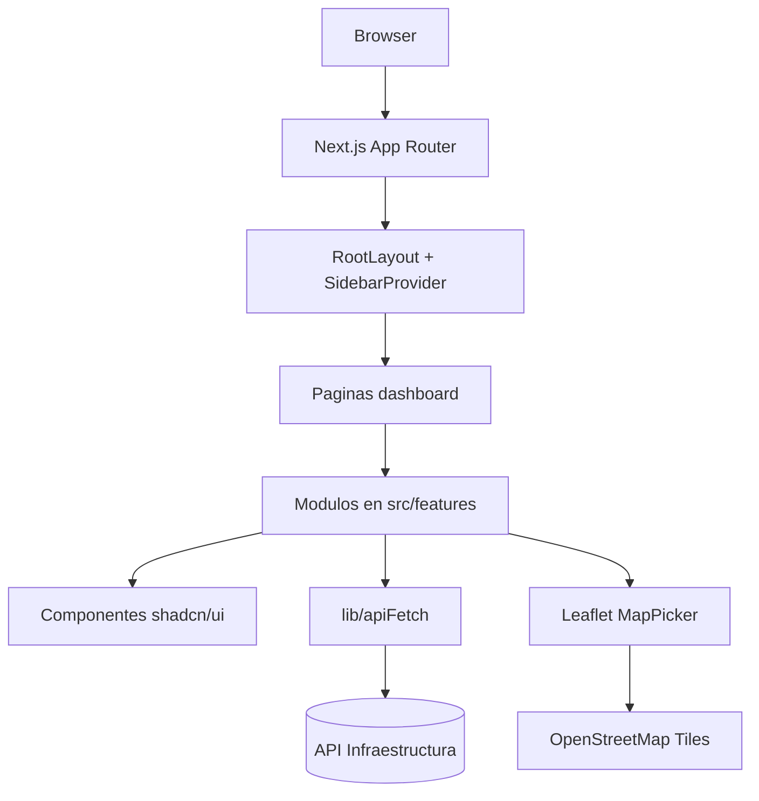

# Arquitectura Tecnica

## Tecnologias Clave
- **Next.js 15 (App Router)**: base del front-end con renderizado hibrido, rutas bajo `src/app` y soporte para componentes del lado del cliente donde se requiere interaccion rica (formularios, mapas).
- **React 19 & TypeScript 5**: tipado estricto y componentes funcionales; se aplica `strict` en `tsconfig` para mantener invariantes del dominio.
- **pnpm**: gestor de paquetes y scripts (`pnpm dev`, `pnpm build`, `pnpm lint`).
- **Tailwind CSS 4 + shadcn/ui (Radix UI)**: diseno compuesto con utilidades y componentes accesibles en `src/components/ui`.
- **React Hook Form + Zod**: validacion declarativa en formularios (`CampusForm`) y reglas compartidas en `src/features/**/schema`.
- **TanStack Table**: tablas interactivas con ordenamiento y control de columnas (`campusColumns`).
- **Leaflet + react-leaflet**: seleccion geoespacial en `MapPicker`, alimentada con teselas de OpenStreetMap.
- **Sonner**: notificaciones de feedback para operaciones CRUD.

## Estructura y Responsabilidades
- `src/app`: puntos de entrada App Router, layouts y paginas por dashboard (`/dashboard/campus/list`). `layout.tsx` orquesta `SidebarProvider`, encabezado y `AppSidebar`.
- `src/components`: UI reusables; `data-table*.tsx` encapsula TanStack Table, `ui/` contiene primitivas shadcn.
- `src/features/<dominio>`: logica de dominio (formularios, tablas, esquemas). Cada carpeta agrupa componentes, validaciones y utilidades de un subdominio (ej. `campus`).
- `src/config`: configuraciones estaticas como navegacion (`NAV_GROUPS`).
- `src/lib`: utilidades transversales (`apiFetch` normaliza peticiones, `env.ts` centraliza variables).

## Flujo de Datos y Estado
1. Las paginas cliente (`'use client'`) solicitan datos al backend expuesto por `NEXT_PUBLIC_API_BASE_URL` usando `fetch` directo o `apiFetch`.
2. Las transformaciones y validaciones se concentran en los esquemas Zod antes de enviar payloads.
3. La UI se compone de bloques shadcn controlados por React Hook Form; los resultados se propagan a TanStack Table y notificaciones Sonner.
4. Interacciones geograficas disparan actualizaciones de estado que sincronizan Leaflet y la UI de formularios.

## Diagrama de Arquitectura

## Consideraciones Tecnicas
- Configurar `NEXT_PUBLIC_API_BASE_URL` via `.env.local`; la capa `env` entrega valores por defecto para desarrollo local.
- Mantener componentes de infraestructura (sidebar, tabla) desacoplados del dominio para favorecer reutilizacion.
- Validar nuevas rutas o features replicando la estructura: pagina en `src/app`, componentes en `src/features`, configuraciones en `src/config`.
